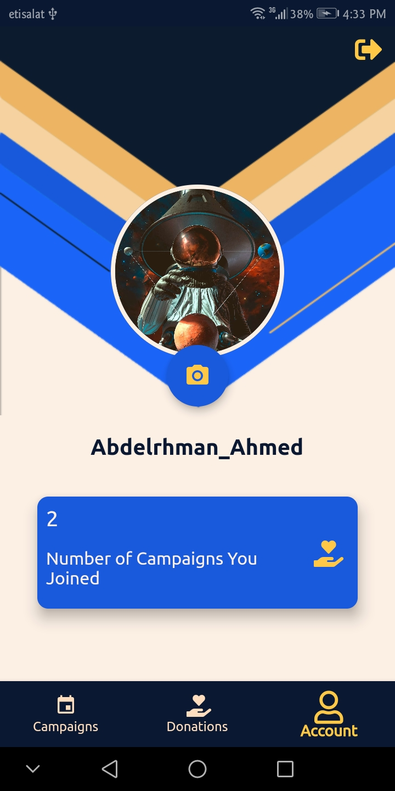
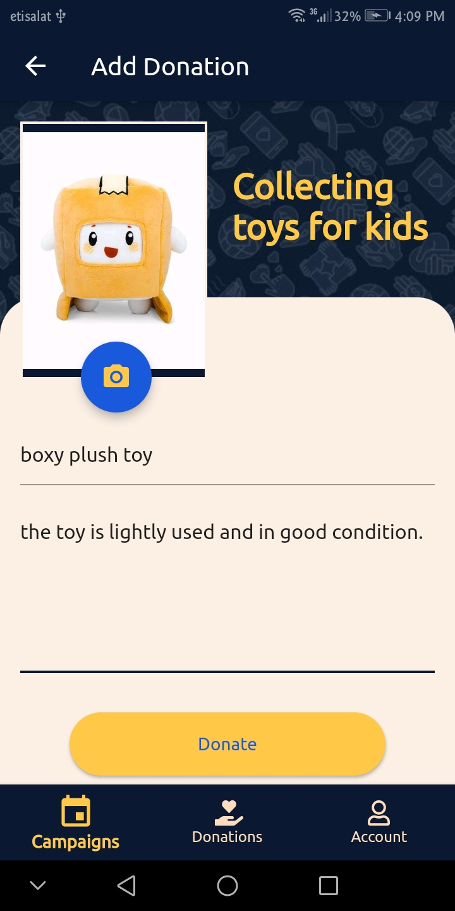

# smile_makers
  a donation app that lets you participate in campaigns and donate all the items
 - participate in monthly updated campaings .
 - Users can add/edit their donated item easily with all important details and save it using Firestore.
 - Using Firebase cloud messaging to push notifications about new campaigns and verifying the donation to the users.
 - Using Firebase authentication to sign up / log in with your email or with your google account.
 - Showing a list for all the item's user had donated with the approving status and the time of donation.
 - Showing all campaigns that the user had participated in.
 - Using BLoC to handle state management.
  
               
  
